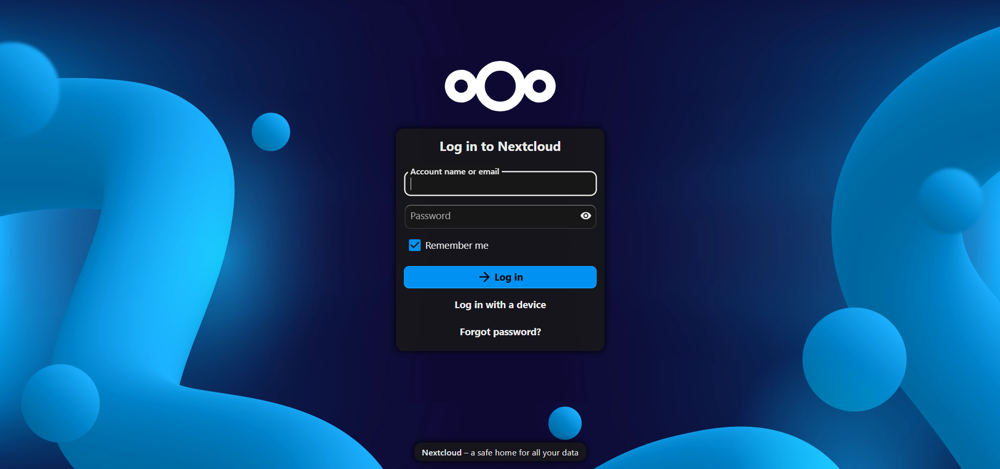
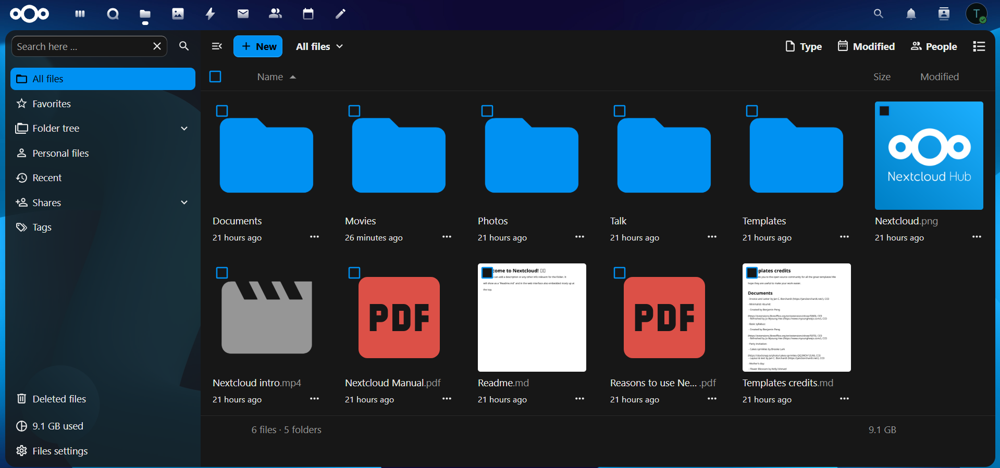
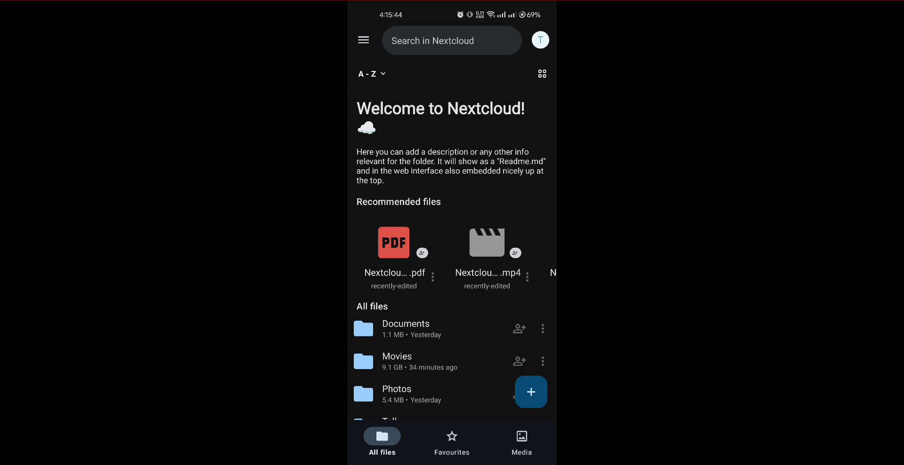

# ☁️ Self-Hosted Cloud Server (Nextcloud + Pi-hole + Nginx + Twingate)


A **self-hosted cloud storage platform** built using Docker, Nextcloud, Pi-hole, Nginx Proxy Manager, and Twingate.
This project demonstrates how to deploy a **private cloud infrastructure similar to Google Drive or Dropbox** while maintaining full control over your data.

---

# 📌 Project Overview

This project sets up a **secure personal cloud server** capable of:

• File storage and synchronization
• Secure file sharing
• Automatic phone photo backup
• Remote access via browser
• Version control and file recovery

The entire infrastructure runs using **containerized services**, making it portable, scalable, and easy to maintain.

---

# 🚀 Features

✔ Self-hosted cloud storage
✔ Secure HTTPS access
✔ Cross-device file synchronization
✔ Automatic backups
✔ Custom local domain with Pi-hole DNS
✔ Reverse proxy with SSL
✔ Zero Trust remote access with Twingate
✔ Scalable container architecture
✔ Open-source infrastructure

---

# 🏗️ System Architecture

```id="rpx20g"
  Local Network Users          Remote Users
       │                        │
       │                        ▼
       │                 Twingate Client
       │                        │
       ▼                        ▼
  Pi-hole DNS (nextcloud.home)  Twingate Cloud
       │                        │
       └──────────────┬─────────┘
          ▼
        Twingate Connector
          │
          ▼
         Nginx Proxy Manager (SSL)
          │
          ▼
        Nextcloud Server
          │
          ▼
       ┌─────────────────────┐
       │                     │
       ▼                     ▼
        MariaDB               Redis
      (Database)             (Cache)
```

---

# 🖥️ Technologies Used

| Technology          | Purpose                  |
| ------------------- | ------------------------ |
| Docker              | Containerized deployment |
| Docker Compose      | Service orchestration    |
| Nextcloud           | Cloud storage platform   |
| MariaDB             | Database backend         |
| Redis               | Performance caching      |
| Pi-hole             | Custom local DNS         |
| Twingate            | Zero Trust remote access |
| Nginx Proxy Manager | Reverse proxy            |
| Let's Encrypt       | SSL certificates         |

---

# 📂 Project Structure

```id="38klvy"
cloud-server/
│
├── docker-compose.yml
├── .env
├── nextcloud/
├── db/
├── redis/
├── npm/
│   ├── data/
│   └── letsencrypt/
├── pihole/
│   ├── etc-pihole/
│   └── etc-dnsmasq.d/
├── backups/
├── backup.sh
└── README.md
```

---

# ⚙️ Installation Guide

## 1️⃣ Install Docker

Update system

```bash id="gld9qg"
sudo apt update
sudo apt upgrade -y
```

Install Docker

```bash id="m9qn6h"
sudo apt install docker.io docker-compose -y
```

Enable Docker

```bash id="40hwhl"
sudo systemctl enable docker
sudo systemctl start docker
```

Verify installation

```bash id="dbdyxj"
docker run hello-world
```

---

# 📁 Create Project Directory

```bash id="p9qdmh"
mkdir ~/cloud-server
cd ~/cloud-server
```

Create folders

```bash id="szcflp"
mkdir -p nextcloud db redis backups npm/data npm/letsencrypt pihole/etc-pihole pihole/etc-dnsmasq.d
```

---

# 🧩 Host Network Prerequisites

Before running Pi-hole and Nginx Proxy Manager on the same server, prepare the host network.

## 1️⃣ Give your server a static LAN IP

Example:

```id="static-ip"
192.168.1.20
```

Use DHCP reservation in router (recommended) or static netplan config.

## 2️⃣ Check port usage on host

Pi-hole requires DNS ports and Nginx Proxy Manager requires web ports.

```bash
sudo ss -tulpen | grep -E ':53|:67|:80|:443|:81'
```


```bash
sudo rm -f /etc/resolv.conf
echo "nameserver 1.1.1.1" | sudo tee /etc/resolv.conf
```

---

# 🐳 Docker Compose Configuration

Create compose file

```bash id="cc45zw"
nano docker-compose.yml
```

Paste configuration

```yaml id="wjwju0"
services:

  db:
    image: mariadb:11
    container_name: nextcloud-db
    restart: always
    volumes:
      - ./db:/var/lib/mysql
    environment:
      MYSQL_ROOT_PASSWORD: rootpassword
      MYSQL_DATABASE: nextcloud
      MYSQL_USER: nextcloud
      MYSQL_PASSWORD: nextcloudpassword

  redis:
    image: redis:alpine
    container_name: nextcloud-redis
    restart: always
    volumes:
      - ./redis:/data

  app:
    image: nextcloud:apache
    container_name: nextcloud-app
    restart: always
    ports:
      - 8080:80
    volumes:
      - ./nextcloud:/var/www/html
    environment:
      MYSQL_HOST: db
      MYSQL_DATABASE: nextcloud
      MYSQL_USER: nextcloud
      MYSQL_PASSWORD: nextcloudpassword
      REDIS_HOST: redis
    depends_on:
      - db
      - redis
```

For full deployment with Pi-hole, Nginx Proxy Manager, and Twingate, replace with:

```yaml
services:

  db:
    image: mariadb:11
    container_name: nextcloud-db
    restart: unless-stopped
    command: --transaction-isolation=READ-COMMITTED --binlog-format=ROW
    volumes:
      - ./db:/var/lib/mysql
    environment:
      MYSQL_ROOT_PASSWORD: rootpassword
      MYSQL_DATABASE: nextcloud
      MYSQL_USER: nextcloud
      MYSQL_PASSWORD: nextcloudpassword
    networks:
      - cloudnet

  redis:
    image: redis:alpine
    container_name: nextcloud-redis
    restart: unless-stopped
    volumes:
      - ./redis:/data
    networks:
      - cloudnet

  app:
    image: nextcloud:apache
    container_name: nextcloud-app
    restart: unless-stopped
    expose:
      - "80"
    volumes:
      - ./nextcloud:/var/www/html
    environment:
      MYSQL_HOST: db
      MYSQL_DATABASE: nextcloud
      MYSQL_USER: nextcloud
      MYSQL_PASSWORD: nextcloudpassword
      REDIS_HOST: redis
    depends_on:
      - db
      - redis
    networks:
      - cloudnet

  nginx-proxy-manager:
    image: jc21/nginx-proxy-manager:latest
    container_name: nginx-proxy-manager
    restart: unless-stopped
    ports:
      - "80:80"
      - "81:81"
      - "443:443"
    volumes:
      - ./npm/data:/data
      - ./npm/letsencrypt:/etc/letsencrypt
    networks:
      - cloudnet

  pihole:
    image: pihole/pihole:latest
    container_name: pihole
    restart: unless-stopped
    ports:
      - "53:53/tcp"
      - "53:53/udp"
      - "67:67/udp"
      - "8081:80/tcp"
    environment:
      TZ: "Asia/Dhaka"
      WEBPASSWORD: "change-this-password"
      FTLCONF_dns_listeningMode: "all"
      FTLCONF_webserver_api_password: "change-this-password"
    volumes:
      - ./pihole/etc-pihole:/etc/pihole
      - ./pihole/etc-dnsmasq.d:/etc/dnsmasq.d
    cap_add:
      - NET_ADMIN
    networks:
      - cloudnet

  twingate-connector:
    image: twingate/connector:latest
    container_name: twingate-connector
    restart: unless-stopped
    environment:
      TWINGATE_NETWORK: "your-network-name"
      TWINGATE_ACCESS_TOKEN: "your-access-token"
      TWINGATE_REFRESH_TOKEN: "your-refresh-token"
    networks:
      - cloudnet

networks:
  cloudnet:
    driver: bridge
```

Validate and run:

```bash
docker compose config
docker compose up -d
docker compose ps
```

---

# ▶️ Start the Server

Run the containers

```bash id="ctt47n"
docker compose up -d
```

Verify containers

```bash id="me62im"
docker ps
```

---

# 🌐 Access the Cloud

Quick access options

```id="izrq7i"
http://localhost:8080
```

If using full stack with Nginx + Pi-hole, use:

```id="full-access-url"
https://nextcloud.home
```

Create:

• Admin username
• Admin password

---

# 🔐 Configure Trusted Domains

Enter container

```bash id="cvcxoc"
docker exec -it nextcloud-app bash
```

Edit config

```bash id="n4l3s2"
nano /var/www/html/config/config.php
```

Modify trusted domains

```php id="76ci1g"
'trusted_domains' =>
array (
  0 => 'localhost',
  1 => '192.168.1.20',
  2 => 'nextcloud.home',
),
```

Restart container

```bash id="ui5d8r"
docker restart nextcloud-app
```

---

# 🌐 Nginx Proxy Manager Setup

This routes `nextcloud.home` to Nextcloud and enables HTTPS.

## 1️⃣ Open Nginx Proxy Manager

```id="npm-ui"
http://192.168.1.20:81
```

Default login:

```id="npm-default-login"
Email: admin@example.com
Password: changeme
```

Change email and password immediately after first login.

## 2️⃣ Create Proxy Host for Nextcloud

In NPM dashboard:

```id="npm-path"
Hosts -> Proxy Hosts -> Add Proxy Host
```

Use:

```id="npm-proxy-config"
Domain Names: nextcloud.home
Scheme: http
Forward Hostname / IP: nextcloud-app
Forward Port: 80
Block Common Exploits: ON
Websockets Support: ON
```

Enable advanced options for larger file uploads (recommended for Nextcloud):

```nginx
client_max_body_size 10G;
proxy_read_timeout 3600;
proxy_send_timeout 3600;
send_timeout 3600;
```

# ⚡ Enable Redis Caching

Add to `config.php`

```php id="cxw08e"
'memcache.locking' => '\\OC\\Memcache\\Redis',
'memcache.local' => '\\OC\\Memcache\\Redis',

'redis' => [
  'host' => 'redis',
  'port' => 6379,
],
```

---

# 🧭 Pi-hole Custom Domain (Local DNS)

Use Pi-hole so your Nextcloud is reachable with a domain like `nextcloud.home` instead of only an IP.

## 1️⃣ Open Pi-hole admin and complete initial setup

Open Pi-hole admin panel:

```id="pihole-ui"
http://192.168.1.20:8081/admin
```

If you changed host IP/port, adjust accordingly.

Initial checks:

- Confirm upstream DNS (Cloudflare/Google/Quad9)
- Confirm blocking lists are loaded
- Change web password if still default

## 2️⃣ Add local DNS record in Pi-hole

Go to:

```id="pihole-menu"
Local DNS -> DNS Records
```

Add record:

```id="pihole-record"
Domain: nextcloud.home
IP: 192.168.1.20   # your Docker host / reverse proxy host
```

## 3️⃣ Ensure clients use Pi-hole as DNS

Set router DHCP DNS (or static DNS on devices) to your Pi-hole IP.

Recommended router DHCP DNS:

```id="pihole-dhcp"
Primary DNS: 192.168.1.20
Secondary DNS: (blank) or another Pi-hole instance
```

Avoid setting public DNS as secondary on clients, otherwise some queries bypass Pi-hole.

## 4️⃣ Test resolution

From a client machine:

```bash
nslookup nextcloud.home
ping nextcloud.home
```

If it resolves to your server IP, local DNS is working.

## 5️⃣ Useful Pi-hole commands

```bash
docker exec -it pihole pihole status
docker exec -it pihole pihole -g
docker logs -f pihole
```

---

# 🌍 Twingate Access From Any Network

Twingate lets you securely access your home/server network without opening inbound router ports.

## 1️⃣ Create Twingate tenant and network

- Sign up at Twingate and create a tenant.
- Create one Remote Network, for example: `homelab`.

## 2️⃣ Deploy Twingate Connector (Docker)

Add this service to your `docker-compose.yml`:

```yaml
  twingate-connector:
    image: twingate/connector:latest
    container_name: twingate-connector
    restart: unless-stopped
    environment:
      TWINGATE_NETWORK: "your-network-name"
      TWINGATE_ACCESS_TOKEN: "your-access-token"
      TWINGATE_REFRESH_TOKEN: "your-refresh-token"
```

Then start it:

```bash
docker compose up -d twingate-connector
docker logs -f twingate-connector
```

## 3️⃣ Publish resources in Twingate admin

Create resources such as:

- `nextcloud.home` (port 443)
- `192.168.1.20` (if you want direct IP access too)
- Optional full subnet resource: `192.168.1.0/24`

Attach these resources to the `homelab` remote network and assign user/group access policy.

## 4️⃣ Connect from anywhere

- Install Twingate client on laptop/phone.
- Sign in with your identity provider account.
- Access Nextcloud from any network:

```id="twingate-url"
https://nextcloud.home
```
---

# 🔄 Automatic Backup

Create backup script

```bash id="u9eqbt"
nano backup.sh
```

```bash id="hrp4rw"
#!/bin/bash

DATE=$(date +%F)

docker exec nextcloud-db mysqldump -u root -prootpassword nextcloud > backups/db-$DATE.sql

tar -czf backups/files-$DATE.tar.gz nextcloud
```

Make executable

```bash id="7ngtkj"
chmod +x backup.sh
```

Schedule daily backup

```bash id="ng1q8l"
crontab -e
```

Add

```id="8ypw22"
0 3 * * * /home/user/cloud-server/backup.sh
```
---

# 📸 Screenshots

## Login Page



## Files View



## Mobile UI



---

# 🧰 Troubleshooting

Check running containers

```bash id="ys8y4p"
docker ps
```

View logs

```bash id="gldkyg"
docker compose logs
```

Restart containers

```bash id="ksw3j0"
docker compose restart
```


## 👤 Author

**Sakawat Kabir Tanveer**

[](https://www.linkedin.com/in/s-kbr13)
[](https://x.com/tanveer_sakawat)

---

# 📜 License

This project is licensed under the **MIT License**.

---